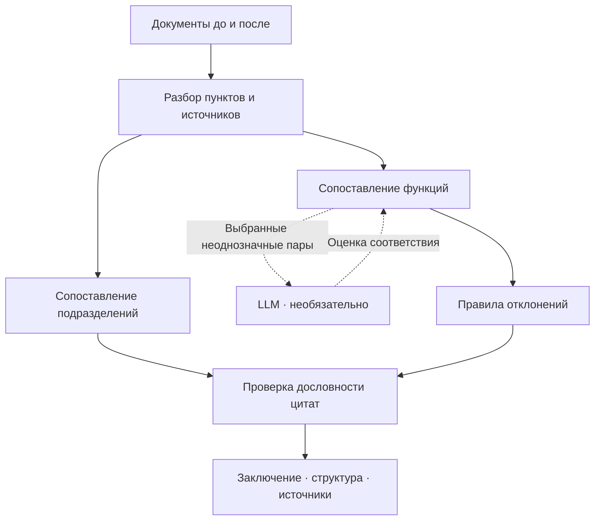

# Artifex — OrgSolvency

## Agentic document extraction and Lineage review

The current integration adds a TypeScript agentic pipeline and the Lineage review
workspace alongside the original Python engine below. The Python Word loader is
reused; the original Python UI, detectors, and regression suite remain available.

```bash
npm ci
npm run dev                 # http://127.0.0.1:4173 (or next free port)
```

Requires Node.js 24+ and Python 3. In **Document extraction**, upload before/after
documents or load **Edition 8 / 9**, then extract, inspect/export JSON, and compare.
The full organizer documents are included as Markdown exports in `corpus/full/`.
`corpus/rev8.txt` and `corpus/rev9.txt` remain the original team's excerpt corpus.

For agentic mode, configure `.env` using `.env.example`:

```dotenv
OPENAI_API_KEY=your-api-key
OPENAI_MODEL=gpt-4.1-mini
```

Restart the server after changing environment configuration. Keys stay server-side.
The model is configurable. `OPENAI_BASE_URL` is optional, but the endpoint must
support **Responses API, strict structured outputs and function tools**. A server
that supports only Chat Completions is not a drop-in replacement for this pipeline.
These settings are separate from the original Python engine's `ARTIFEX_AI_*` variables.

The structure, responsibility, and review agents can search/read source clauses.
Code owns IDs, source spans, graph validation, bounded repair, caching and budgets.
Each revision returns JSON with `graph.nodes`, `graph.edges`, `functions`, `issues`,
coverage, provenance and a tool-execution trace. Positions, departments, external
bodies and groups are distinct; administrative and functional reporting are distinct.

```bash
npm run extract -- --examples --output .data/local-extraction.json
npm run extract -- --examples --agentic --output .data/agentic-extraction.json
npm run extract -- --input request.json --output result.json
npm run schema
npm test
npm run build
python3 tests/document_bridge_test.py
```

Text, Markdown and Word input work with Python's standard library. Text PDFs and
Excel need optional parsers: `python3 -m pip install -r requirements-input.txt`
(use a virtual environment and set `PYTHON_BIN` to its interpreter when needed).
Scanned PDFs need external OCR; missing text is reported, not fabricated. Word
automatic numbering is flagged; embedded objects/drawings are not reconstructed.

**Accuracy boundary:** local mode produces a conservative structural baseline and
unassigned responsibility candidates. It is not a substitute for agentic semantic
extraction. Unowned responsibilities remain in JSON and are excluded from ownership
comparison with explicit warnings. Agentic extraction also needs human review.
Source-span validation proves provenance, not semantic correctness or legal validity.
Live OpenAI accuracy on the full documents is not yet benchmarked; model protocol
tests use deterministic mocks. The organizer-document regressions check known
structural facts, context, renumbering, and source fidelity, not a complete answer key.

See [pipeline architecture and JSON contract](docs/agentic-extraction.md),
[example provenance and benchmark scope](corpus/full/README.md), and the
[Lineage comparison documentation](docs/lineage-app.md).

---

### Проверка ответственности при реорганизации

Artifex помогает сотруднику, анализирующему организационные изменения,
сопоставить подразделения и функции в документах «до» и «после»,
выявить возможные потери и пересечения ответственности
и подготовить заключение с проверяемыми источниками.

**Ключевой вопрос: обязательство организации сохранилось —
а кому теперь поручено его выполнение?**

Проект разработан командой **Artifex** для HackAlem AI,
трек «Анализ организационной структуры и функционала».

**Статус:** работающий прототип. Базовый сценарий запускается
локально без API-ключей. Выводы требуют проверки ответственным сотрудником.

[Установка и запуск](#установка-и-запуск) ·
[Проверка для жюри](#как-проверить-решение) ·
[Результаты](#измеренные-результаты) ·
[Ограничения](#ограничения)

### Агентный анализ документов

В репозитории также доступно рабочее место Lineage для извлечения графа
подразделений, должностей и функций из документов «до» и «после»:

```bash
npm ci
npm run dev
```

Откройте `http://127.0.0.1:4173` и вкладку **Document extraction**.
Режим **Local baseline** работает без ключа и оставляет неустановленных владельцев
функций для проверки. Для **Agentic** укажите `OPENAI_API_KEY` в локальном `.env`
по образцу `.env.example` и перезапустите сервер. Экспорт включает граф, функции,
дословные цитаты и предупреждения о неполном покрытии.

Это отдельный TypeScript-сценарий; приведённые ниже результаты и инструкции
для Python-приложения относятся к исходному контрольному корпусу. Подробнее:
[архитектура и JSON-контракт](docs/agentic-extraction.md).

## Какую проблему решаем

При реорганизации меняются названия подразделений, состав должностей
и распределение полномочий. Обязательства при этом могут сохраняться
в других разделах документов.

Сотруднику необходимо вручную установить, какие функции сохранились,
кому они переданы и где могли возникнуть пробелы или пересечения.

Artifex объединяет сравнение структуры, проверку функций
и просмотр подтверждающих фрагментов в одном рабочем сценарии.

### Почему это не решается сравнением текстов

Документы при реорганизации переписываются целиком: разделы
перенумеровываются, формулировки меняются, полномочия переезжают между
главами. Расходится практически всё, и текстовый дифф тонет в шуме.
Важнее другое — какие выводы вообще невозможно получить сравнением:

| Наблюдение | Почему дифф его не берёт |
|---|---|
| П. 5.6.3 исчез, но п. 11.2 через шестьдесят страниц всё ещё требует эту работу | обязательство и полномочие лежат в разных главах и текстуально не похожи |
| Функция выдана в главе 2 и запрещена в главе 5 | обе нормы в **одном** документе — сравнивать не с чем |
| Подразделение оценивает качество аудита, подчиняясь тому, кого оценивает | нужно понимать, что означает независимость |

Поэтому решение строит модель организации и проверяет цепочку:

```
обязательство → покрывающее его полномочие → живое подразделение-владелец → отсутствие запрета
```

Каждый класс наблюдения — разрыв в этой цепочке. Сравнение редакций
оказывается частным случаем такой проверки.

### Пример из контрольных документов

| Источник | Что содержит |
|---|---|
| Редакция 8, п. **5.6.3** | Полномочие вносить предложения по объёму и содержанию внешней оценки БВА |
| Редакция 9, п. **11.2** | Сохранившееся требование проводить внешнюю оценку качества аудита |

Если соответствие прежнему полномочию не найдено,
а требование продолжает действовать, возникает **возможный разрыв ответственности**.

Прототип выделяет два связанных наблюдения:
потенциальную потерю функции и обязательство без найденного
соответствующего полномочия.

Сотрудник получает исходные пункты и проверяет,
передана ли функция другому владельцу или закреплена в другом документе.

## Что реализовано

| Обязательное требование | Возможность прототипа | Где посмотреть |
|---|---|---|
| Определить сохранённые, преобразованные и созданные подразделения | Извлечение и сопоставление подразделений; предварительные статусы, включая упразднение | Вкладка **«Структура»** |
| Сопоставить функции и выявить возможные потери | Поиск соответствий между редакциями; выделение потенциальных потерь и передач | Вкладка **«Отклонения»** |
| Выявить дублирование и потенциальные конфликты интересов | Правила пересечения функций, самооценки и противоречий между полномочиями и запретами | Соответствующие группы наблюдений |
| Показать источник каждого вывода | Номер пункта, дословная цитата и переход к выделенному фрагменту извлечённого текста | Раскрытое наблюдение → **«в документе →»** |
| Сформировать понятное заключение | Краткий итог, группировка по последствиям, объяснения и рекомендации | Верхний блок результатов |

Дополнительно реализованы:

- обнаружение изменений обязательности норм по шкале
  `обязан > должен > осуществляется > может > вправе`: так «осуществляется
  анализ» превращается в «может осуществляться», и обязанность становится
  возможностью, не изменив ни одного существительного;
- проверка ссылок, сохранивших номер после перенумерации;
- поиск по тексту вывода и номеру пункта;
- фильтрация наблюдений по выбранному подразделению;
- копирование заключения и экспорт результата в JSON;
- создание HTML-отчёта при консольном запуске.

Из опциональных требований кейса реализованы рекомендации по устранению
(строка «Что делать» у каждого наблюдения). Сопоставление с законодательством
и бенчмаркинг с другими операторами не реализованы.

Все пять направлений представлены в пользовательском сценарии.
Наличие функции в прототипе не означает полного обнаружения
всех возможных случаев — качество измеряется отдельно.

## Как работает решение

**Документы → сопоставление → наблюдения → источники → заключение.**

1. Пользователь загружает комплекты **«до»** и **«после»**.
2. Система извлекает нумерованные пункты, текст, владельцев функций
   и ссылки между пунктами.
3. Сопоставляет подразделения и функциональные формулировки.
4. Применяет отдельные правила к возможным отклонениям.
5. Проверяет дословное присутствие цитат в извлечённом тексте.
6. Показывает структуру изменений и аналитическое заключение.
7. Сотрудник проверяет источники и использует результат
   для дальнейшего согласования изменений.

Подача каждого наблюдения отвечает на четыре вопроса:

**Что обнаружено → почему это важно → где источник → что проверить дальше.**

Выводы об отсутствии функции требуют отдельной проверки:
ненайденное соответствие ещё не доказывает утрату ответственности.
Присутствие нормы подтверждается цитатой, отсутствие — не подтверждается
ничем, поэтому такие наблюдения помечены «требует проверки».

## Технологии

| Область | Реализация |
|---|---|
| Язык анализа и сервера | Python; синтаксис совместим с 3.9+, проверенный запуск — 3.12 и 3.14 |
| Чтение DOCX | Стандартные библиотеки `zipfile`, `re`, `html` |
| Сопоставление текста | Нормализация слов и коэффициент Жаккара |
| Проверка отклонений | Детерминированные правила Python |
| Интерфейс | HTML, CSS, JavaScript без фреймворка и сборки |
| Локальный HTTP-сервер | `http.server` |
| Обмен данными | JSON, загрузка файлов через `multipart/form-data` |
| Необязательный модельный слой | Адаптеры OpenAI и Anthropic через `urllib` |
| Проверка качества | Размеченный корпус, отрицательные примеры и тестовые сценарии |

Для базового режима не нужны `pip install`, Node.js,
база данных или внешние сервисы. Отсутствие зависимостей — решение,
а не ограничение: между машиной разработчика и машиной жюри нечему
сломаться, а `xml.etree` не используется намеренно, потому что парсер
`expat` в ряде сборок Python на macOS подгружает несовместимую `libexpat`
и падает на импорте — мы на это наткнулись во время разработки.

### Роль AI-модели

LLM используется для выбранных неоднозначных пар пунктов и отвечает
на ограниченный вопрос:

> Описывают ли эти формулировки одну и ту же функцию?

Модель подключается только в зоне неопределённости лексического
сопоставления — при сходстве `0.18 ≤ s < 0.45`. Выше совпадение очевидно,
ниже нормы заведомо разные. На контрольном комплекте это **пять обращений
вместо семисот попарных сравнений**. Вердикты кэшируются по паре текстов
и модели, поэтому повторный прогон воспроизводим.

Номера пунктов и цитаты извлекаются программно.
Модель не участвует в их формировании, поэтому ссылка на несуществующий
пункт невозможна даже при полной галлюцинации. Слой правил, извлечение
источников и модельное сопоставление можно проверять отдельно.

Конкретная модель выбирается через `ARTIFEX_AI_MODEL`.
Опубликованный ниже контрольный результат получен **без LLM**.
Прирост качества от реальной модели пока не измерен.

## Архитектура проекта

Подход — **гибридное сопоставление с правилами и проверкой источников**.
Принцип разделения: **модель читает, код решает.** Извлечение фактов
допускает модель, но сам вывод формируется детерминированным кодом,
поэтому результат воспроизводим и объясним по шагам.

Для подразделений учитываются аббревиатуры, названия,
сходство функциональных описаний и состав должностей.
Точное совпадение аббревиатуры имеет приоритет.

Для функций выполняются отдельные проверки: соответствие между
редакциями, смена владельца, пересечение, изменение обязательности,
противоречие и отсутствие найденного полномочия.



| Компонент | Назначение |
|---|---|
| `orgsolvency/ingest.py` | Чтение документов |
| `orgsolvency/core.py` | Пункты, владельцы, модальность, ссылки и позиции цитат |
| `orgsolvency/units.py` | Сопоставление подразделений |
| `orgsolvency/detect.py` | Правила поиска отклонений |
| `orgsolvency/ai.py` | Подключение модельного сопоставления |
| `orgsolvency/verify.py` | Проверка дословности цитат |
| `orgsolvency/summary.py` | Подготовка заключения |
| `orgsolvency/report.py` | HTML-отчёт и JSON |
| `orgsolvency/score.py` | Сравнение результата с разметкой |
| `webapp/` | Сервер и пользовательский интерфейс |
| `tests/` | Регрессионные проверки: дословность цитат, рубеж полноты, разъём модели |
| `tools/make_docx.py` | Сборка `.docx` из текста без зависимостей — для проверки боевого пути загрузки |

Документация для разработчиков:
[docs/api-contract.md](docs/api-contract.md) — контракт движка и интерфейса ·
[docs/case-analysis.md](docs/case-analysis.md) — ручной разбор контрольного комплекта ·
[docs/design-principles.md](docs/design-principles.md) — правила подачи выводов ·
[BENCHMARK.md](BENCHMARK.md) — замер и разбор каждого пропуска.

## Установка и запуск

### 1. Подготовьте окружение

Нужны Git, Python и современный браузер.
Для воспроизведения рекомендуем Python 3.12.

```bash
python3 --version
git --version
```

### 2. Склонируйте репозиторий

```bash
git clone https://github.com/BAITC-Hacks/hack-ea8492f8-artifex.git
cd hack-ea8492f8-artifex
```

Результаты этого README проверены на коммите
`494fa80e7b65b6859bc8f704a87434406e514d4f`.

Для точного воспроизведения этой версии:

```bash
git checkout 494fa80e7b65b6859bc8f704a87434406e514d4f
```

### 3. Запустите базовый режим

macOS / Linux:

```bash
ARTIFEX_AI=none python3 webapp/server.py --port 8000 --no-open
```

Windows PowerShell:

```powershell
$env:ARTIFEX_AI = "none"
python webapp/server.py --port 8000 --no-open
```

Откройте **http://127.0.0.1:8000**.

Если порт занят, укажите другой, например `--port 8001`,
и откройте соответствующий адрес. Остановка сервера — `Ctrl+C`.

### 4. При необходимости подключите LLM

Настройте переменные окружения:

| Переменная | Значение |
|---|---|
| `ARTIFEX_AI` | `openai` или `anthropic` |
| `ARTIFEX_AI_KEY` | Ваш ключ выбранного провайдера |
| `ARTIFEX_AI_MODEL` | Идентификатор доступной вашему аккаунту модели |

Перезапустите сервер. Автоматическая загрузка `.env` не предусмотрена.

При включении провайдера выбранные фрагменты документов отправляются
его API. Ключи не должны попадать в репозиторий.

## Как проверить решение

### Сценарий для жюри

После запуска нажмите **«Контрольный комплект»**.

| Действие | Ожидаемый результат |
|---|---|
| Откройте **«Структура»** | 1 сохранённое, 1 преобразованное, 2 созданных и 1 упразднённое подразделение/звено |
| Найдите **`5.6.3`** | Наблюдение о возможной потере полномочия по внешней оценке |
| Найдите **`11.2`** | Наблюдение о сохранившемся обязательстве без найденного соответствующего полномочия |
| Найдите **`5.1.4`** | Кандидаты на пересечение функций, включая сопоставление с п. 5.3.7 |
| Найдите **`9.15`** | Изменение «осуществляется анализ» → «может осуществляться анализ» |
| Раскройте наблюдение и нажмите **«в документе →»** | Исходный текст с выделенной цитатой |
| Нажмите **«Экспорт»** | JSON с результатами анализа |

Так проверяются структура, функции, отклонения,
прослеживаемость и итоговое заключение.

### Измеренные результаты

Контрольный запуск без модели на версии `494fa80`:

| Показатель | Результат |
|---|---:|
| Разобрано пунктов «до / после» | 44 / 42 |
| Сформировано наблюдений | 23 |
| Найдено ожидаемых случаев | 14 из 25 |
| Полнота обнаружения — recall | 56% |
| Пропущено ожидаемых случаев | 11 |
| Наблюдений вне сопоставленной разметки | 9 |
| Нарушений на двух отрицательных примерах | 0 |
| Цитат отклонено проверкой дословности | 0 |

Находка засчитывается при совпадении типа отклонения
и основного номера пункта с ручной разметкой.

**56% — полнота на включённом контрольном корпусе, а не общая
точность системы.** Девять несопоставленных наблюдений требуют
ручного разбора. Два пройденных отрицательных примера
не означают отсутствия ложных срабатываний на других данных.

[BENCHMARK.md](BENCHMARK.md) перечисляет все пропуски поимённо с причиной
каждого. **Десять из двенадцати имеют одну причину: тождество смысла при
разной формулировке.** Это и есть точка, в которой в систему входит модель,
и её вклад будет виден числом, а не декларацией.

### Команды проверки

Запускайте из корня репозитория в режиме `ARTIFEX_AI=none`:

```bash
python3 run.py
python3 tests/smoke.py
python3 tests/ai_seam.py
```

`run.py` выводит найденные и пропущенные случаи, а также создаёт:

- `out/report.html` — читаемый отчёт;
- `out/findings.json` — машинное представление наблюдений.

`tests/ai_seam.py` использует тестового провайдера без сети.
Он проверяет подключение модельного слоя,
но не качество реальной LLM.

### Проверка на документах из другого домена

`corpus/demo/` — синтетический комплект по закупкам, а не по внутреннему
аудиту, с намеренно внесёнными дефектами. Это имитация проверки
из п. 11 технического задания: правила видят этот документ впервые.

```bash
python3 run.py corpus/demo/before.txt corpus/demo/after.txt
```

| Что внесено в документы | Ожидаемое наблюдение |
|---|---|
| Удалено полномочие «согласовывает годовой план закупок» (было п. 4.1.3) | потеря функции на п. 4.1.3 |
| При этом п. 7.1 по-прежнему требует утверждать план | обязательство без исполнителя на п. 7.1 |
| «Ведение реестра договоров» закреплено и за ДЗ, и за новым ДКЗ | дублирование на паре 4.1.5 / 4.3.1 |
| ДКЗ поручено «принимать решения о выборе поставщика» при действующем запрете | коллизия 4.3.2 против 5.2.1 |
| «Проверка осуществляется» → «может осуществляться» | ослабление нормы на п. 7.3 |
| Снята периодичность отчёта | **не обнаруживается** — задача модельного слоя |

Пять из шести внесённых дефектов найдены. Разбор: [corpus/demo/ОТВЕТЫ.md](corpus/demo/ОТВЕТЫ.md).

Для своих документов:

```bash
python3 run.py before.docx after.docx
```

## Данные и интеграции

В репозитории используются:

- `corpus/rev8.txt`, `corpus/rev9.txt` — выдержки из обезличенных
  документов организатора с сохранёнными формулировками и номерами;
- `golden/golden.json` — 27 вручную размеченных случаев,
  из которых 25 входят в текущую выдержку, и 2 отрицательных примера;
- `corpus/demo/` — синтетический комплект по закупкам
  с заранее заданными изменениями;
- пользовательские DOCX и текстовые файлы,
  загружаемые в комплекты «до» и «после».

Для базового анализа не требуются внешние API.
При отключённом модельном слое документы обрабатываются локально
и не покидают машину пользователя.

Необязательные интеграции:
**OpenAI Chat Completions API** и **Anthropic Messages API**.
В них передаются выбранные текстовые фрагменты;
вердикты кэшируются локально в `.cache/ai.json`.
Организационные положения относятся к внутренней информации компании —
включайте модельный слой только для материалов, разрешённых
к такой обработке.

## Ограничения

- Текущая версия использует русскоязычные шаблоны и эвристики.
  Переформулировки, частичные передачи и сложные изменения
  ответственности могут быть пропущены.
- Для анализа нужна явная нумерация вида `5.6.3. Текст`.
  Автонумерация Word не восстанавливается; ненумерованные абзацы
  не анализируются как самостоятельные пункты.
- PDF, Excel, OCR и полноценный разбор организационных диаграмм
  не реализованы. Просмотр источника показывает извлечённый текст,
  а не оригинальную вёрстку Word.
- При повторении номеров в нескольких документах требуется
  дополнительная проверка однозначности ссылок.
- Проверка дословности цитаты не доказывает правильность вывода.
  Она также не заменяет отдельную проверку номера пункта.
- Сходство описаний функций не равно доле фактически сохранённых
  обязанностей. Статусы подразделений требуют содержательной проверки.
- Проверки дублирования и конфликтов пока не опираются
  на полноценный граф подчинённости.
- Коллизии с запретом на контрольном комплекте не срабатывают ни разу:
  оба известных случая требуют смыслового сравнения.
- Проверка законодательства, сравнение с другими операторами
  и автономный поиск контрдоказательств не реализованы.
- Это локальный прототип без авторизации и промышленной
  инфраструктуры размещения.

**Приоритет развития:** повысить полноту смыслового сопоставления,
усилить проверку источников и измерить качество на новых
независимых комплектах документов.

## Развёрнутая версия

Публичная развёрнутая версия не публикуется намеренно:
организационные положения — внутренние документы компании,
и решение спроектировано так, чтобы они не покидали машину пользователя.

Проверенный способ демонстрации — локальный запуск:

**http://127.0.0.1:8000**

Репозиторий:
https://github.com/BAITC-Hacks/hack-ea8492f8-artifex
