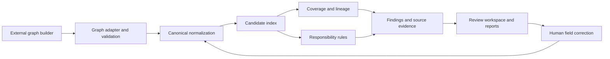

# Lineage

A runnable organizational-change analysis workspace for HackAlem. It starts with an already constructed **before/after graph** and analyzes the responsibilities attached to its departments.

The graph builder's external format is intentionally undecided. The internal JSON contract below is a working integration target, not a requirement on your future builder. Map its output in `server/adapters/graph.ts` when that format is ready.

## Run locally

Requires Node.js 24 or newer (the server uses Node's built-in SQLite) and npm.

```sh
npm ci
npm run dev
```

Open `http://127.0.0.1:4173`. If the port is occupied, the server selects the next available port and prints the address. The first launch analyzes a synthetic sample automatically. No API key is needed for that sample or for complete, normalized input.

```sh
npm test
npm run evaluate
npm run build
npm start
```

`npm start` serves the built UI. Analyses, reviews, and normalization cache are persisted in `.data/lineage.sqlite`. This local directory and `.env` are excluded from Git. The app binds to loopback and is designed as a single-user hackathon workspace.

## What works

- Graph input validation: types, dates, identifiers, references, monetary bounds, and reporting cycles.
- Function normalization into action, object, process, scope, authority, conditions, modality, frequency, and monetary bounds.
- Preserved, transferred, split, merged, partially covered, changed, unmatched, and uncertain function transitions.
- Duplicate ownership, execution/approval overlap, audit independence (including transitive reporting lines), and contradictory mandates.
- Evidence quote-presence checks with source inspection and highlighted passages.
- Department transitions using explicit predecessor IDs, stable IDs, and name-based fallback.
- A findings queue with saved confirmation/dismissal decisions and reviewer notes.
- Editing normalized function fields followed by a new analysis. Older runs and their reviews remain available.
- Read-only graph visualization, source document view, saved analysis history, printable HTML reports, findings CSV, analysis JSON, and normalized graph JSON.
- AI normalization caching, candidate comparison metrics, processing time, and actual API token counts when applicable.

Document parsing, OCR, department/function extraction from files, and graph construction are outside this implementation. The upstream graph should include source text and quotations. The UI visualizes the supplied structure; it does not construct that structure from documents.

## Optional AI normalization

Configure these environment variables in a local `.env` file using `.env.example` as the template:

```dotenv
OPENAI_API_KEY=your-api-key
OPENAI_MODEL=gpt-4.1-mini
PORT=4173
```

Restart the server, then choose **AI-assisted** in the import dialog. Only functions missing `canonical` fields are sent for normalization. The implementation uses the OpenAI Responses API with a JSON schema, `store: false`, bounded batches, token accounting, and a cache keyed by description, model, and prompt version. One compound description can become several atomic functions; each supporting quote must occur in the original description. Failed, missing, duplicated, or unsupported output is rejected rather than silently accepted.

AI mode sends raw function descriptions to the configured OpenAI service. Supplied canonical functions are reused. The API key stays on the server. The integration is covered with mocked provider tests; live model accuracy must be evaluated against the organizer's data.

References: [Structured Outputs](https://developers.openai.com/api/docs/guides/structured-outputs), [Responses API](https://developers.openai.com/api/reference/resources/responses).

## Graph integration

Start with `examples/sample-graph.json`. `examples/graph-input.schema.json` is a machine-readable schema generated from `shared/schema.ts`. Regenerate both with `npm run schema`.

```json
{
  "schemaVersion": "1.0",
  "title": "September reorganization",
  "before": {
    "id": "before",
    "label": "Current organization",
    "date": "2026-06-01",
    "documents": [],
    "departments": [],
    "functions": [],
    "relationships": []
  },
  "after": {
    "id": "after",
    "label": "Proposed organization",
    "date": "2026-09-01",
    "documents": [],
    "departments": [],
    "functions": [],
    "relationships": []
  }
}
```

| Entity       | Required data                                                                                                    |
| ------------ | ---------------------------------------------------------------------------------------------------------------- |
| Document     | `id`, `title`, `text` containing the cited passages                                                              |
| Department   | `id`, `name`; optional `parentId`, `previousIds`, and `evidence`                                                 |
| Function     | `id`, `departmentId`, `description`, at least one `evidence` item; optional `canonical` and `normalizationNotes` |
| Relationship | `id`, `fromId`, `toId`, type (`reports_to`, `oversees`, or `audits`), and evidence                               |
| Evidence     | `documentId`, `locator` (page/clause/section), and `quote`                                                       |

IDs are unique within each entity collection and snapshot. Function-to-department, parent, relationship, and evidence references must resolve in their own snapshot. An after-department's `previousIds` references before-departments. `reports_to` points from subordinate to superior; `oversees` and `audits` point from supervisor/auditor to the target. Evidence on hierarchy edges is required for source-backed independence findings; unproven parent links can still be visualized.

Example canonical responsibility:

```json
{
  "action": "approve",
  "object": "contract",
  "process": "contract management",
  "scope": ["domestic", "international"],
  "authority": "decision",
  "conditions": [],
  "modality": "required",
  "frequency": null,
  "threshold": { "min": 0, "max": 1000000, "currency": "KZT" }
}
```

### Canonical semantics

- Each canonical function represents one action and responsibility. Split compound clauses upstream or use AI normalization.
- `scope: ["*"]` means an explicitly universal scope. `scope: []` means unknown and cannot establish equivalence. Scope items are exact categories after terminology normalization, not an ontology; `Europe` does not automatically include `France`.
- `threshold: null` means no documented numeric restriction. A null endpoint is unbounded. Bounds are inclusive. Currency comparisons require matching currency codes. Put strict inequality/exception language in `conditions` and keep unresolved interpretations in `normalizationNotes`.
- `conditions: []` means no documented extra conditions. Conditions are compared as normalized sets; different free-text conditions do not automatically prove equivalence.
- `frequency: null` means no frequency is stated. Stated frequencies must match for full lineage equivalence.
- `modality` distinguishes `required`, `permitted`, `prohibited`, and `unknown`.
- `authority` distinguishes `execution`, `recommendation`, `decision`, `oversight`, `independent_assurance`, and `unknown`.
- `normalizationNotes` preserve uncertainty through graph export and reanalysis. A reviewer explicitly correcting a function clears those notes for that function only. Complete fields are an upstream assertion, not proof that the extraction is correct.

If you omit canonical fields in local mode, the conservative extractor recognizes a limited English/Russian vocabulary and leaves uncertain fields unknown. These functions generate review flags instead of verified coverage. General multilingual semantic extraction belongs in AI mode or the upstream graph builder.

## Analysis approach



The index retains every exact object/process candidate plus up to eight lexical candidates. A lexical score is a retrieval score, not a probability that two responsibilities are equivalent. Detailed comparison keeps action, authority, scope, conditions, modality, frequency, and limits separate.

Split coverage is evaluated per scope: successor monetary intervals must cover each original scope independently. This avoids incorrectly combining a domestic lower range with an international upper range and declaring full coverage. Separate original scopes sharing a complete successor are marked as merged.

Duplicate ownership requires compatible responsibilities and overlapping scope/limits across different departments. Execution/approval and independent-audit checks use authority plus the supplied organizational structure. They are generic policy-review flags, not legal findings or judgments about employees.

Source checking locates the quoted text in the supplied document text after Unicode/whitespace normalization. It does **not** authenticate the document, verify the page number, or prove that a normalized field is entailed by the quote. Those distinctions are retained in the report.

## Project layout

| Path                         | Responsibility                                                  |
| ---------------------------- | --------------------------------------------------------------- |
| `shared/schema.ts`           | Runtime schemas and shared types                                |
| `shared/input.ts`            | Reimportable graph export preserving uncertainty                |
| `server/adapters/graph.ts`   | Integration point for the future graph builder                  |
| `server/engine/validate.ts`  | Structural and source validation                                |
| `server/engine/normalize.ts` | Canonical cleanup and conservative local extraction             |
| `server/normalization.ts`    | Optional structured AI extraction and cache                     |
| `server/engine/analyze.ts`   | Matching, interval/scope coverage, graph rules, findings        |
| `server/store.ts`            | SQLite runs, reviews, and normalization cache                   |
| `server/report.ts`           | Escaped HTML and spreadsheet-safe CSV exports                   |
| `server/app.ts`              | Express API                                                     |
| `src/App.tsx`                | Review workflow                                                 |
| `src/OrgGraph.tsx`           | React Flow visualization with Dagre layout                      |
| `tests/`                     | Engine, validation, provider-boundary, and API regression tests |

## API

| Method | Endpoint                            | Purpose                                                                     |
| ------ | ----------------------------------- | --------------------------------------------------------------------------- |
| GET    | `/api/config`                       | AI availability and engine metadata, never credentials                      |
| GET    | `/api/demo`                         | Synthetic sample graph                                                      |
| GET    | `/api/schema`                       | Internal graph JSON schema                                                  |
| POST   | `/api/analyze`                      | `{ "graph": {...}, "normalization": "local" }` or `"ai"`                    |
| GET    | `/api/runs`                         | Latest 50 saved analyses                                                    |
| GET    | `/api/runs/:id`                     | Analysis, normalized graph, and saved reviews                               |
| PATCH  | `/api/runs/:id/findings/:findingId` | `{ "status": "confirmed", "note": "..." }`; also `unreviewed` / `dismissed` |
| GET    | `/api/runs/:id/export/html`         | Printable report; use the browser's Print to PDF                            |
| GET    | `/api/runs/:id/export/csv`          | Findings and review notes                                                   |
| GET    | `/api/runs/:id/export/json`         | Full analysis archive                                                       |
| GET    | `/api/runs/:id/export/graph`        | Normalized graph suitable for reimport                                      |

Requests are limited to 12 MB. The schema allows up to 3,000 input functions and 1,000 departments per snapshot. AI normalization is limited to 200 raw functions per request. Runs exceeding 100,000 detailed comparisons or 10,000 findings stop with an explicit error instead of saving a partial report. Only one analysis runs at a time in this local instance.

## Reproducible demo

1. Load the sample case. It contains 11 original functions and 13 after-functions.
2. Open the partial contract-approval finding. The cited limit changes from 10,000,000 KZT to 1,000,000 KZT.
3. Inspect the records-maintenance function: domestic and international successors jointly cover it.
4. Inspect the unmatched security-incident reporting function and duplicate supplier-compliance ownership.
5. Inspect the invoice execution/approval overlap and the internal audit team's reporting line to Finance.
6. Confirm or dismiss a finding with a note, then export the printable report.

`npm run evaluate` checks 11 expected transitions and six expected flags against this **synthetic sample only**. It reports exact label accuracy, flag precision/recall, quote presence, candidate comparison counts, and duration. These numbers are not evidence of accuracy on the organizer's unseen documents. Add their labeled graph fixtures to the test set before making such claims.

## Current limits

- An unmatched function means no match was found in the supplied graph; it cannot establish absence from the real organization.
- Unknown terminology and translations can evade local lexical retrieval. There is no embedding search or unconstrained LLM equivalence judge in the comparison engine.
- Conflict rules require comparable objects/processes and explicit overlapping scope. Different free-text conditions are conservatively left for review.
- Dense exact-match buckets can still need quadratic pair checks. Candidate counts measure detailed comparisons, not every retrieval scoring operation.
- The UI displays source text supplied with the graph; it does not render the original Word, PDF, or spreadsheet files.
- Generic conflicts require human policy review. External regulation checking and comparisons with other operators remain optional future extensions.
